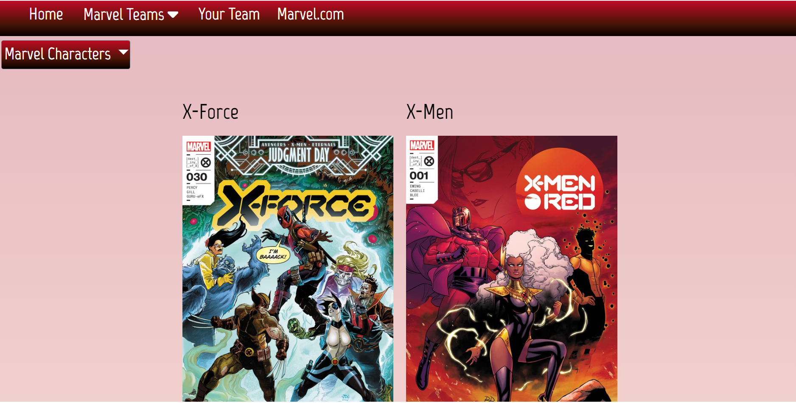
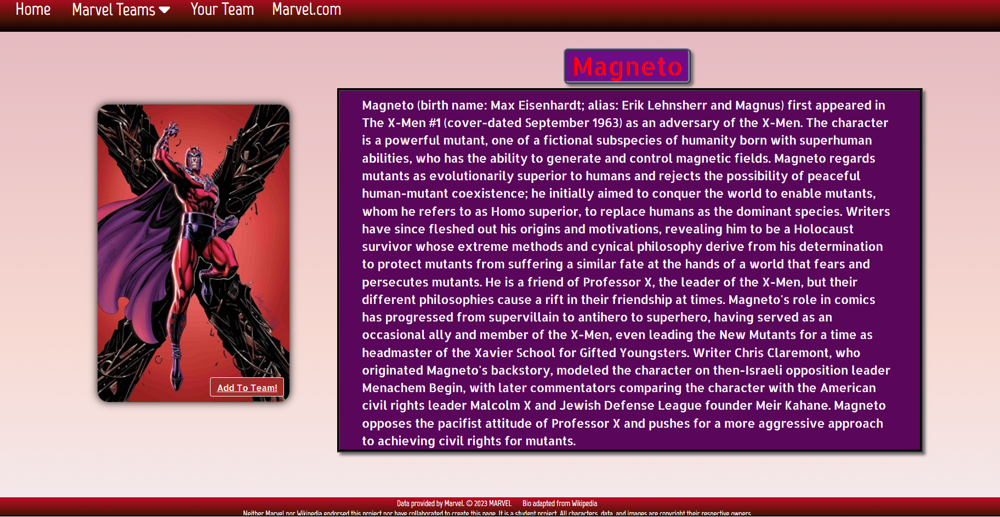
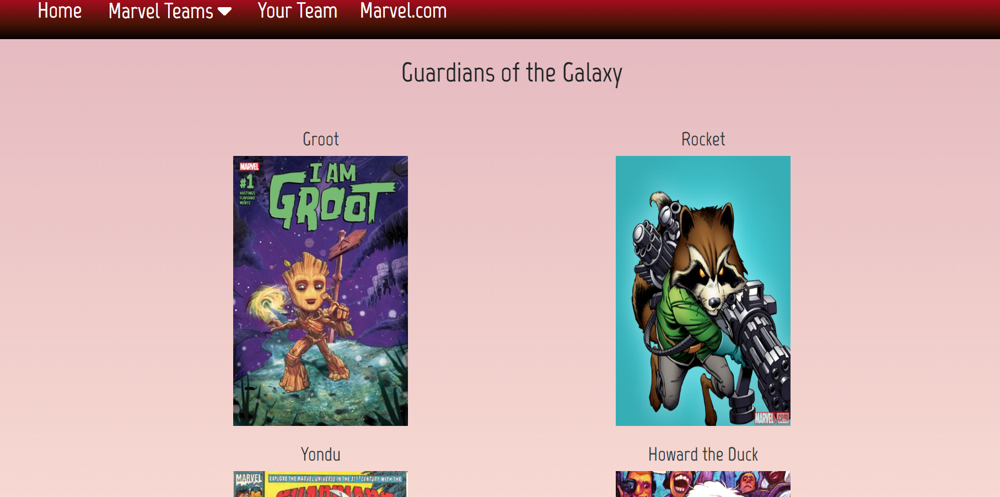
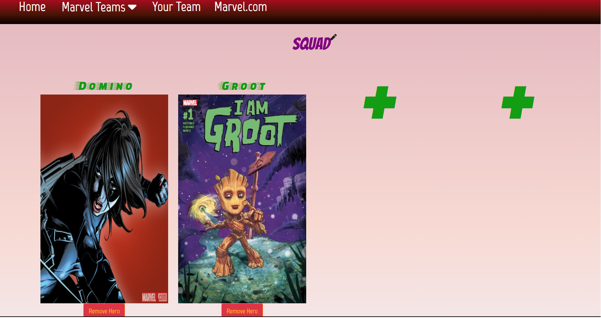

# Marvel-dex
A Pokédex for Marvel Characters!!!!!!!

Deployed link: https://dylanstormjohnson.github.io/marvel-dex/

Website screenshots:

In this project, we created an encyclopedia of Marvel characters. 
To create the website, we used HTML, CSS, JQUERY, and two API keys, namely the Marvel and the Wikipedia API. We also used Bootstrap to help with styling our website.

We created four Marvel teams (X-Men, X-Force, Avengers and Guardians of the Galaxy), with four characters in each team. 
We created a description for each character using the Wikipedia API, and we used the Marvel API to grab images for the characters, as well as their names. Certain images were also taken from Wikipedia, based on personal preference.

We used local storage for people to be able to create their own Marvel teams of four characters, where they can also name their own team. 

In addition, the home page provides users with a dropdown with all the characters that are mentioned on the website, to help users who are unfamiliar with the Marvel universe. 

